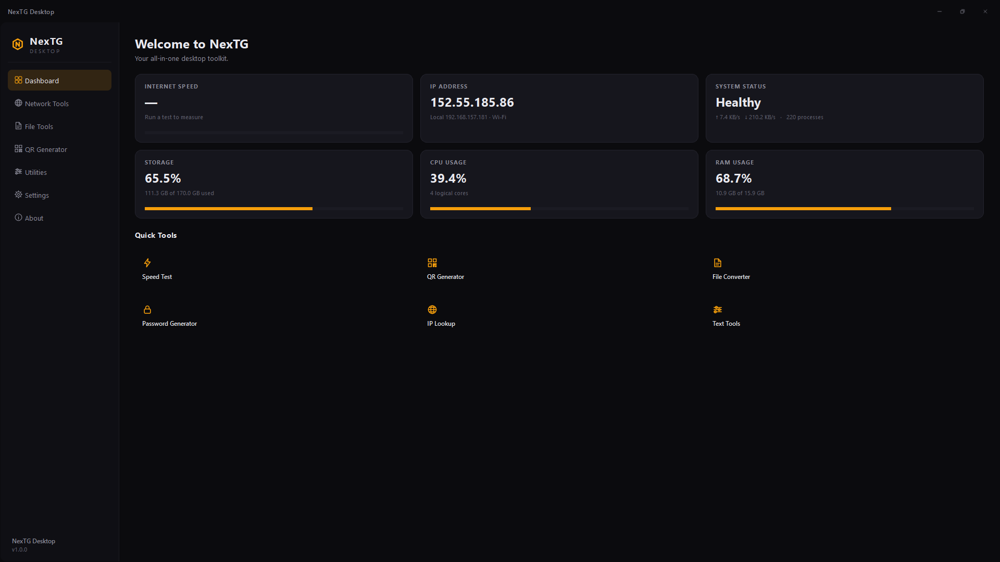
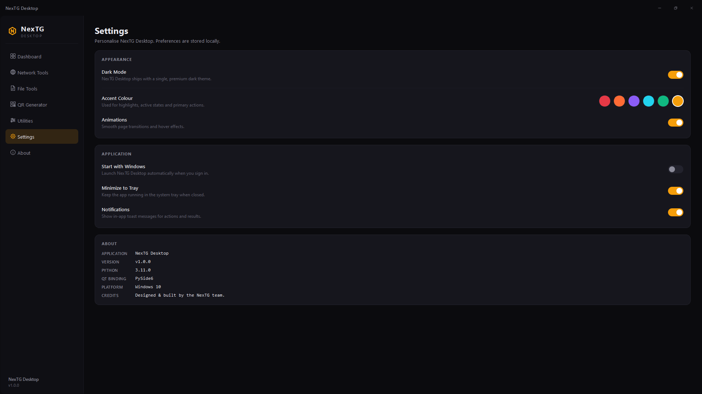
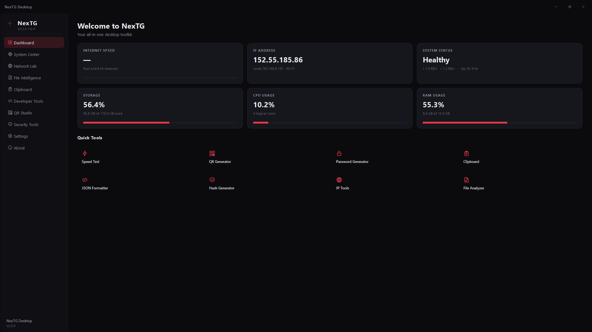
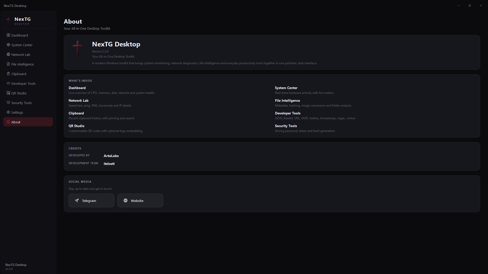

# README.md

```markdown
# NexTG Desktop

**Your All in One Desktop Toolkit**

NexTG Desktop is a modern Windows application that brings your most-used tools
together in one clean, dark interface — system monitoring, network diagnostics,
file intelligence, QR generation, developer utilities and everyday productivity
helpers, all in a single window.


---

## Screenshots

### Dashboard



### Settings



### Version 2 — Overview



### Version 2 — About



---

## What's inside

- **Dashboard** — a live overview of your system: CPU, RAM, storage, network
  activity and IP information, with one-click access to your most-used tools.
- **System Center** — real-time CPU, RAM, disk, GPU, network and uptime.
- **Network Lab** — speed test, ping, DNS lookup, traceroute and full IP and
  connection details.
- **File Intelligence** — file metadata, MD5 / SHA hashing, image conversion,
  folder analysis and duplicate finder.
- **Clipboard** — searchable clipboard history with pinning and type detection.
- **Developer Tools** — JSON, Base64, URL, UUID, hashes, timestamps, regex and
  colour, all in one place.
- **QR Studio** — generate QR codes for text, links, email, Wi-Fi, phone and
  contacts, with custom colours and optional logo.
- **Security Tools** — secure password generator, random token generator and
  text hashing.
- **Settings** — Dark / Light Mode, accent colour, animations, performance mode,
  startup behaviour and privacy controls, all saved automatically.

---

## Highlights

- Premium dark interface with a proper Light Mode
- Smooth, responsive, and lightweight — stays out of your way
- Command palette — press `Ctrl+K` anywhere to jump to any tool or setting
- Runs entirely offline except for the speed test and public IP lookup
- Preferences persist between sessions

---

## Requirements

- Windows 10 or Windows 11 (64-bit)
- ~120 MB free disk space

---

## Installation

1. Download **`NexTG-Setup 2.exe`** from the [Releases](../../releases) page.
2. Run the installer and follow the wizard.
3. Launch **NexTG Desktop** from the Start menu or desktop shortcut.

If you already have version 1 installed, the version 2 installer will upgrade
it in place — your settings are preserved.

---

## Version history

- **v2.0.0** — Major update. New pages, Light Mode, command palette, image
  conversion, developer and security tools, performance mode.
- **v1.0.0** — Initial public release. Core dashboard, network tools, file
  tools, QR generator, utilities and settings.

Full details are available on the [Releases](../../releases) page.

---

## Credits

**NexTG Desktop** is developed by **ArtaLabs**.

**Development Team:** itslosti

---

<p align="center">
  <sub>Built with care. Designed for speed.</sub>
</p>
```

---

# Difference between Version 1 and Version 2

## Version 1 — the foundation

Version 1 shipped the essential toolkit: **six pages** in the sidebar.

| Section | What it did |
|---|---|
| Dashboard | Six live stat cards and a Quick Tools grid. |
| Network Tools | Speed test, IP info, ping. |
| File Tools | File metadata and MD5 / SHA hashing. |
| QR Generator | Five QR types (Text, URL, Email, Wi-Fi, Phone). |
| Utilities | Password generator, text tools, unit converter. |
| Settings | Dark Mode (locked on), accent colour, animations toggle. |
| About | Feature list and credits. |

It had a polished dark theme, custom title bar, system tray, background workers and a signal bus. It was complete and stable — but it was still a *dark-only* app, and the sidebar was a flat list of pages with no deeper structure.

## Version 2 — the overhaul

Version 2 grew the app from six pages to **ten** and rebuilt the parts of the system that V1 had left simple.

### New pages

- **System Center** — a dedicated hardware dashboard that V1 didn't have at all. V1 showed CPU / RAM / disk as small cards on the main Dashboard; V2 pulls them into their own page with GPU, uptime and process count, and keeps the Dashboard focused on the overview.
- **Clipboard** — brand new. Clipboard history with search, pinning and type detection.
- **Developer Tools** — brand new. Eight small utilities (JSON, Base64, URL, UUID, hashes, timestamp, regex, colour) in one page with tabs.
- **Security Tools** — brand new. Password generator, token generator, hashing — pulled out of the old "Utilities" page into their own section.

### Renamed and expanded pages

- **Network Tools → Network Lab.** Added DNS lookup and traceroute. The old ping and speed test were kept but polished.
- **File Tools → File Intelligence.** Added image conversion (PNG, JPEG, WEBP, BMP, GIF, TIFF, ICO), folder analyzer and duplicate finder.
- **QR Generator → QR Studio.** Added the Contact QR type, custom foreground / background colours, and optional logo embedding.
- **Utilities** was split. Text tools and the unit converter now live inside Developer Tools and Security Tools; the split made the sidebar simpler and each page more focused.

### Design and interaction changes

- **Real Light Mode.** V1 had a "Dark Mode" toggle that was permanently locked on. V2 replaces it with a working **Dark / Light** switch — the entire interface re-themes instantly, including sidebar, cards, inputs, borders, icons, scrollbars and toasts. The preference is saved between sessions.
- **Command Palette** (`Ctrl+K`). New in V2. Search every page, tool, setting and action from one box. This didn't exist in V1.
- **Performance Mode.** New in V2. Reduces animation durations and monitoring frequency for older machines. Works alongside the existing Animations toggle.
- **Animations layer, rewritten.** V1 had a simple animations system. V2 routes every fade, stagger and progress animation through a single gate that respects both the Animations toggle and Performance Mode, so durations scale automatically.
- **Theme system rebuilt.** V1's theme was a class with hard-coded colours. V2 uses a `Palette` dataclass with DARK and LIGHT definitions, plus a proxy that keeps V1-era code working. That's what made real Light Mode possible without touching every file.
- **Branding.** V1 was credited to "the NexTG team". V2 credits **ArtaLabs** with the **itslosti** team, and removes every mention of implementation details (Python, PySide, Qt, framework) from the visible UI.
- **Icon integration.** V2 wires the `POr` icon into the title bar, sidebar, About page, tray and window chrome consistently.

### Bug fixes

- **Speed test `fileno` crash.** V1 could crash with `'NoneType' object has no attribute 'fileno'` on windowed builds. V2 neutralises the underlying cause and always shows a friendly message on genuine failures.
- **System monitor hardened.** No monitoring failure can interrupt the UI. Technical details go to `data/nextg.log` instead of being shown to the user.
- **Theme toggle ambiguity.** V1's Dark Mode button could leave the user unsure of the current state. V2's switch is a clear on/off with matching labels.

### Summary table

| | Version 1 | Version 2 |
|---|---|---|
| Sidebar pages | 6 | 10 |
| Theme | Dark only | Dark + Light |
| Command palette | — | `Ctrl+K` |
| System monitoring | Dashboard cards | Dedicated System Center + Dashboard cards |
| Network tools | Speed test, ping, IP | + DNS lookup, traceroute |
| File tools | Metadata, hashing | + image conversion, folder analyzer, duplicate finder |
| QR types | 5 | 6 (+ Contact), custom colours, logo |
| Clipboard manager | — | Yes |
| Developer tools | — | Yes (8 utilities) |
| Security tools | — | Yes (own page) |
| Performance mode | — | Yes |
| Speed test `fileno` bug | Present | Fixed |
| Icon consistency | Partial | Full |
| Branding | NexTG team | ArtaLabs · itslosti |

The upgrade path is a straight replacement: the v2 installer detects a v1 installation and upgrades in place, keeping your settings.
